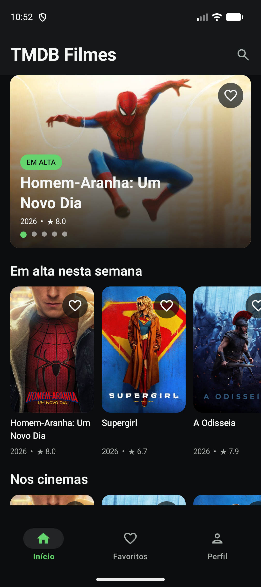
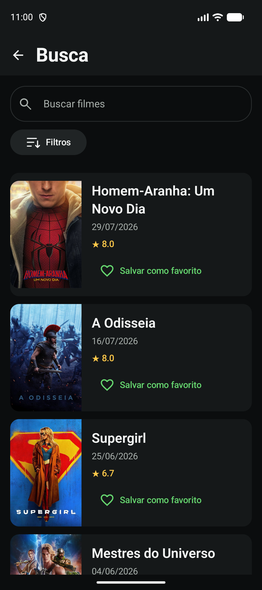
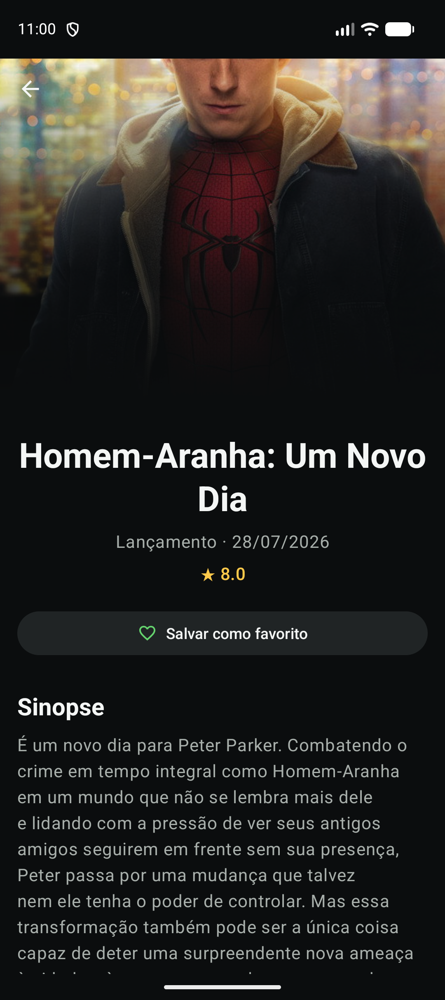
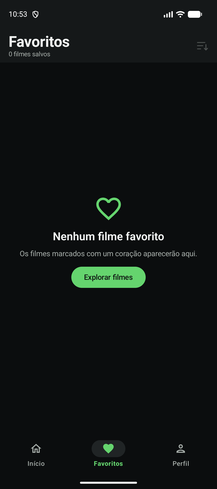

# TMDB Filmes

Aplicativo Android nativo para descobrir, pesquisar, filtrar, detalhar e favoritar filmes usando a API do [The Movie Database (TMDB)](https://www.themoviedb.org/).

## Experiência

- Início editorial com destaque, filmes em alta, em cartaz, clássicos e mais bem avaliados.
- Busca paginada por título, com debounce, cancelamento e filtros compatíveis com o endpoint ativo.
- Detalhes em Fragment XML com banner/backdrop, data, nota, favorito e sinopse.
- Favoritos locais persistidos com Room, busca e cinco ordenações sem depender de rede.
- Perfil local com resumo real da coleção, versão e atribuição do TMDB.
- Estados explícitos de loading, vazio, erro, conteúdo e retry.

## Screenshots

| Início | Busca | Detalhes | Favoritos |
|---|---|---|---|
|  |  |  |  |

As imagens foram capturadas no emulador com dados reais retornados pelo TMDB em 3 de agosto de 2026.

## Stack e arquitetura

- Kotlin, Coroutines, Flow, StateFlow e LiveData.
- Jetpack Compose nas telas de Início, Busca, Favoritos e Perfil.
- Fragment + XML + View Binding em Detalhes.
- Navigation Component com uma única Activity.
- Retrofit, Kotlin serialization e OkHttp para rede.
- Paging 3 com `PagingSource` remoto, sem `RemoteMediator`.
- Room como fonte de verdade dos favoritos.
- Koin para injeção de dependências e Coil para imagens.

O projeto usa um único módulo `app` e mantém a direção `UI → domínio ← dados`. DTOs, entidades Room, modelos de domínio e modelos de UI são convertidos nas fronteiras; `PagingData` é a única dependência AndroidX permitida no contrato paginado do domínio. As decisões completas estão em [ARCHITECTURE.md](docs/context/ARCHITECTURE.md).

## Pré-requisitos

- Android Studio com suporte a AGP 9.3 ou execução equivalente por linha de comando.
- JDK 17.
- Android SDK 36.
- Um API Read Access Token do TMDB.

A baseline completa e datada está em [TECH_BASELINE.md](docs/context/TECH_BASELINE.md).

## Configuração

1. Clone o repositório.
2. Copie `local.properties.example` para `local.properties`.
3. Configure o SDK e o token local:

```properties
sdk.dir=/caminho/absoluto/para/Android/sdk
TMDB_ACCESS_TOKEN=seu_api_read_access_token
```

4. No Android Studio, selecione JDK 17 (o Embedded JDK é a opção recomendada).
5. Sincronize o Gradle e execute a configuração `app`, ou use:

```bash
./gradlew assembleDebug
adb install -r app/build/outputs/apk/debug/app-debug.apk
```

O token entra somente no build local e é enviado pelo interceptor como `Authorization: Bearer …`. Ele não deve ser salvo em código, recursos, logs, fixtures ou commits. Token ausente ou inválido é convertido em uma orientação segura na interface, sem exibir credenciais nem detalhes internos.

## Verificação

Gates padrão:

```bash
./gradlew assembleDebug
./gradlew testDebugUnitTest
./gradlew lintDebug
```

Com um emulador ou dispositivo disponível:

```bash
./gradlew connectedDebugAndroidTest
```

Os testes cobrem parsing e mapeamento, política de endpoints/filtros, paginação, repositories, ViewModels, persistência Room e os estados críticos das telas Compose/XML.

## Estrutura principal

```text
app/src/main/java/com/example/tmdbmovies/
├── app/                 # Application e Activity
├── core/               # erro, rede, banco, imagens e tema
├── data/               # Retrofit, DTOs, Room e repositories
├── domain/             # modelos e contratos independentes
├── feature/
│   ├── details/        # Fragment XML + LiveData
│   ├── discover/       # Home editorial
│   ├── favorites/      # coleção local
│   ├── movies/         # busca, filtros e Paging
│   └── profile/        # perfil local e créditos
└── di/                 # módulos Koin
```

## Limites desta versão

Não há login ou sincronização com conta TMDB, séries, trailers, elenco, histórico assistido, analytics ou cache geral do catálogo. Favoritos são locais e imagens dependem de rede. Esses limites evitam sugerir funcionalidades que o aplicativo ainda não persiste ou oferece.

## Atribuição

This product uses the TMDB API but is not endorsed or certified by TMDB.

O aplicativo também exibe o logotipo e esse aviso na tela Perfil, conforme as diretrizes do TMDB.

## Documentação

- [AGENTS.md](AGENTS.md): regras permanentes para agentes.
- [CONTEXT.md](CONTEXT.md): estado atual e histórico curto de decisões.
- [PRODUCT.md](docs/context/PRODUCT.md): requisitos e critérios de aceite.
- [DESIGN_SYSTEM.md](docs/context/DESIGN_SYSTEM.md): direção visual e acessibilidade.
- [TMDB_API.md](docs/context/TMDB_API.md): endpoints, autenticação e política de filtros.
- [QUALITY.md](docs/context/QUALITY.md): estratégia e checklist de qualidade.
- [PLAN.md](docs/execution/PLAN.md): fases incrementais de execução.
